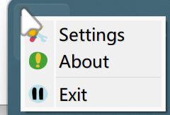
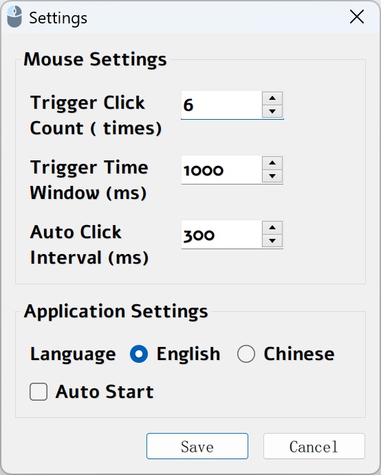

# RapidClicker

A lightweight automatic mouse clicking tool for Windows.

The standout feature of RapidClicker is that it runs in the background. No need to remember shortcuts or open settings. Just double - click the left mouse button to the default times and hold it down to auto - click.

[中文文档](README_ZH.md)

## Screenshot



**Tray**



**Settings**

## Features

- Intelligent click detection: automatically detects when you need rapid clicking
- System tray integration: runs silently in the background
- Highly configurable: customize trigger conditions and clicking speed
- Multi-language support: English and Chinese interfaces
- Small footprint: takes minimal system resources

## How It Works

1. When you click your mouse quickly (default: 5 times within 300ms), the tool enters "rapid click mode"
2. After entering this mode, as long as you hold down the left mouse button, RapidClicker will automatically click at the specified interval
3. When you release the mouse button, automatic clicking stops

## Usage Scenarios

- Games that require rapid clicking
- Applications where repeated clicking is needed
- Testing UI responsiveness
- Any scenario where you want to avoid repetitive strain injury from clicking

## Installation

### Method 2: Download Standalone Executable

1. Go to the [Releases page](https://github.com/yanstu/RapidClicker/releases)
2. Download `RapidClicker.exe`
3. Run the executable (no installation required)

## Configuration

Right-click the tray icon and select "Settings" to configure:

- **Trigger Click Count**: How many clicks are needed to enter rapid click mode (default: 5)
- **Trigger Time Window**: Maximum time window (in milliseconds) for trigger clicks (default: 300ms)
- **Auto Click Interval**: Time interval between automatic clicks (in milliseconds) (default: 500ms)
- **Language**: Choose between English and Chinese
- **Auto Start**: Launch automatically when Windows starts

## Building from Source

### Prerequisites

- Python 3.7 or higher
- Required packages: see `requirements.txt`

### Steps

1. Clone the repository:
   ```
   git clone https://github.com/yanstu/RapidClicker.git
   cd RapidClicker
   ```

2. Install dependencies:
   ```
   pip install -r requirements.txt
   ```

3. Run the build script:
   ```
   build.bat
   ```

4. Find the built application in the `dist` directory

## License

MIT License - see the [LICENSE](LICENSE) file for details.

## Author

Created by [yanstu](https://github.com/yanstu)

## Contributing

Contributions are welcome! Please feel free to submit a Pull Request. 
