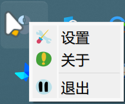
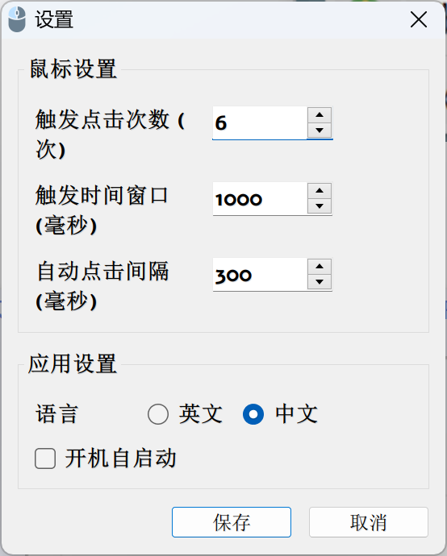

# RapidClicker

一个轻量级的Windows自动鼠标连点工具。

RapidClicker 的最大亮点是常驻后台，无需记忆快捷键或提前打开设置。只需按默认配置连续点击鼠标左键达到设定次数后长按，即可自动连点，让操作更顺畅。

[English](README.md)

## 程序截图



**系统托盘**



**设置界面**

## 功能特点

- 智能点击检测：自动识别何时需要连续点击
- 系统托盘集成：在后台静默运行
- 高度可配置：自定义触发条件和点击速度
- 多语言支持：英文和中文界面
- 资源占用小：占用极少系统资源

## 工作原理

1. 当您快速点击鼠标（默认：在300毫秒内点击3次）时，工具进入"快速点击模式"
2. 进入该模式后，只要按住鼠标左键，RapidClicker就会以指定的间隔自动点击
3. 松开鼠标按钮时，自动点击停止

## 使用场景

- 需要快速点击的游戏
- 需要重复点击的应用程序
- 测试UI响应性
- 任何想要避免重复点击造成手部劳损的场景

## 安装方法

1. 前往[发布页面](https://github.com/yanstu/RapidClicker/releases)
2. 下载`RapidClicker.exe`
3. 运行可执行文件（无需安装）

## 配置选项

右键点击托盘图标并选择"设置"进行配置：

- **触发点击次数**：进入快速点击模式所需的点击次数（默认：5次）
- **触发时间窗口**：触发点击的最大时间窗口（毫秒）（默认：300毫秒）
- **自动点击间隔**：自动点击之间的时间间隔（毫秒）（默认：500毫秒）
- **语言**：选择英文或中文
- **开机自启**：Windows启动时自动启动程序

## 从源代码构建

### 前提条件

- Python 3.7 或更高版本
- 所需包：见`requirements.txt`

### 步骤

1. 克隆仓库：
   ```
   git clone https://github.com/yanstu/RapidClicker.git
   cd RapidClicker
   ```

2. 安装依赖：
   ```
   pip install -r requirements.txt
   ```

3. 运行构建脚本：
   ```
   build.bat
   ```

4. 构建好的应用程序在`dist`目录中

## 许可证

MIT许可证 - 详情请参阅[LICENSE](LICENSE)文件。

## 作者

由[yanstu](https://github.com/yanstu)创建

## 贡献

欢迎贡献！请随时提交拉取请求。 
