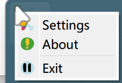
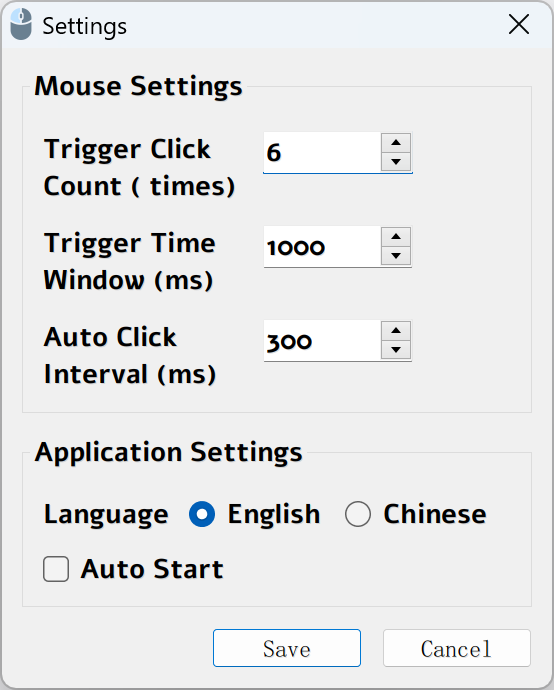

# RapidClicker

RapidClicker 是一个面向 Windows 的轻量级后台自动连点工具。

它常驻系统托盘，以管理员权限启动，适配高 DPI 显示；当你在设定时间窗口内快速点击左键达到阈值后，只要继续按住左键，就会自动持续连点，松开立即停止。

当前原生独立版体积不足 1 MB，下载、分发和直接运行都更轻便，不依赖额外运行时。

[English](README.md)

## 程序截图



**系统托盘**



**设置界面**

## 功能特点

- 原生 Win32 独立可执行文件，发布包小于 1 MB
- 智能点击检测，支持“快速触发 + 按住连点”
- 系统托盘常驻，适合后台长期运行
- 管理员权限启动，对高权限窗口兼容性更好
- 支持高 DPI、英文和中文界面

## 工作原理

1. 当您快速点击鼠标（默认：在300毫秒内点击5次）时，工具进入"快速点击模式"
2. 进入该模式后，只要按住鼠标左键，RapidClicker就会以指定的间隔自动点击
3. 松开鼠标按钮时，自动点击停止

## 使用场景

- 需要快速点击的游戏
- 需要重复点击的应用程序
- 测试UI响应性
- 任何想要避免重复点击造成手部劳损的场景

## 安装方法

1. 前往[发布页面](https://github.com/yanstu/RapidClicker/releases)
2. 下载`RapidClicker.exe`
3. 运行可执行文件

## 配置选项

右键点击托盘图标并选择"设置"进行配置：

- **触发点击次数**：进入快速点击模式所需的点击次数（默认：5次）
- **触发时间窗口**：触发点击的最大时间窗口（毫秒）（默认：300毫秒）
- **自动点击间隔**：自动点击之间的时间间隔（毫秒）（默认：500毫秒）
- **语言**：选择英文或中文
- **开机自启**：Windows 登录后通过计划任务以最高权限启动程序

## 从源代码构建

### 原生构建（默认）

前提条件：

- Visual Studio Community / Build Tools（安装 Desktop development with C++）

步骤：

1. 运行：
   ```
   build.bat
   ```
2. 在以下位置获取原生程序：
   ```
   dist\RapidClicker.exe
   ```

### Python 构建（兼容回退）

前提条件：

- Python 3.7 或更高版本
- 所需包：见`requirements.txt`

### 步骤

1. 克隆仓库：
   ```
   git clone https://github.com/yanstu/RapidClicker.git
   cd RapidClicker
   ```

2. 安装依赖：
   ```
   pip install -r requirements.txt
   ```

3. 运行旧版 Python 构建脚本：
   ```
   build-python.bat
   ```

4. 构建好的 Python 应用程序在`dist`目录中

## 许可证

MIT许可证 - 详情请参阅[LICENSE](LICENSE)文件。

## 作者

由[yanstu](https://github.com/yanstu)创建

## 贡献

欢迎贡献！请随时提交拉取请求。 
